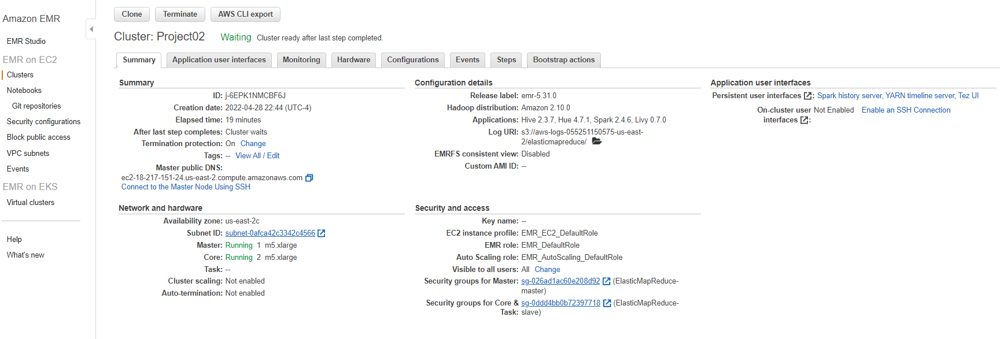
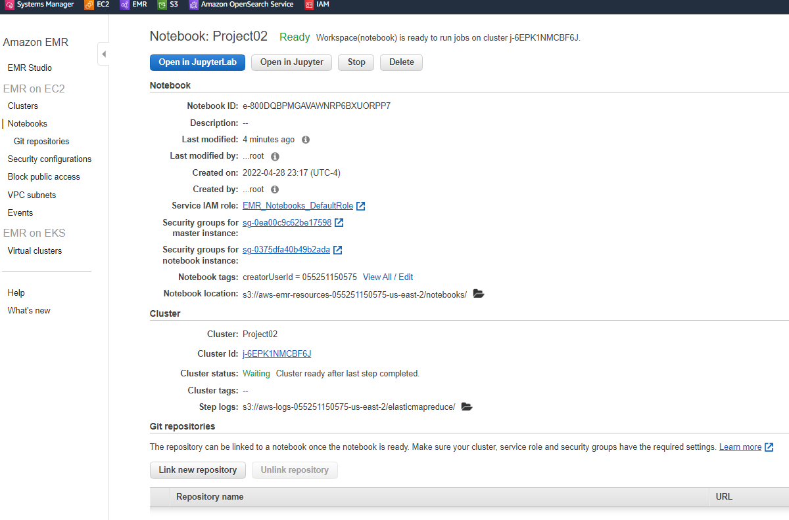

**Analyzing 10Gb of Yelp Reviews Data**

**CIS9760:  Big Data Technology**    

**Project 2: ** **by Sofia Shur**										

**Due Date:**  **4/30/2022**

[TOC]

**Overview**

​	The dataset of Yelp's reviews and businesses in size of 10Gb from Kaggle has been used for running queries and performing analysis in the AWS Elastic Map Reduce ("EMR") Ecosystem and Jupyter Notebook.

##### **Objective** 

​	To demonstrate student's ability and knowledge in the AWS Elastic Map Reduce Ecosystem, Spark jobs and Big Data analysis by leveraging Jupyter Notebook.

##### **Technology**

​	This Big Data project required AWS EMR technological knowledge on a Spark Cluster to load and transform the data.  10Gb of Yelp Data  from Kaggle got uploaded to a personal S3 Bucket. The data exploration and analysis was done using Jupyter Notebook. Spark SQL (PySpark) has been used for a series of queries.

Steps:

1) Created a cluster on EMR

- Provisioning the Hardware
- Configuring Jupyter Notebook

2) Running Spark cluster tasks via Jupyter Notebook

- Basic Notebook operations and Kernel
- Loading your data into S3
- Loading your data to EMR from S3
- Cleaning up
- Running queries

##### **Requirements**

EMR Cluster Configuration:

****

Notebook configuration:

****

##### **Assignment**

##### 	**Part I: Installation and Initial Setup**

​	Installed and imported required libraries: pandas, numpy, matplotlib.pyplot, seaborn and scipy. Loaded three .json files separately from a personal S3 bucket. Each dataset was explored using DataFrameSchema and filtering functions.

##### 	**Part II: Analyzing Categories**

​	Distinct categories and association tables have been created by using pyspark.sql functions and explode split function. Sorting, Grouping and Count functions helped to provide some statistic on various data categories. 

##### 	**Part III: Do Yelp Reviews Skew Negative?**

​	Yes, Yelp reviews skew negative. The distribution of written reviews/skew curve (in blue) is non-symmetric comparing to the bell-shaped curve (in black) for symmetric distribution. The plot of the Skew distribution does not have a well-defined center of data distribution that implies to a satisfaction rate differences between reviewers who wrote an actual review and reviewers who just provided a star rating. It is "skewed left" which means that reviewers who wrote an actual review are generally more pessimistic as compared to the overall business rating. 

*Implications:* Sometimes it is a more convenient way of resolving or escalating issues directly to a business owner/manager by proving feedbacks on Yelp. Hypothetically, customers who wrote an actual review probably were dissatisfied with the business and spent some time on writing a review on Yelp as a way to inform the business management. On contrary, customers that were satisfied with the business and had no issues with service/product usually have no incentives to write a good review unless it is paid or rewarded. Therefore, a slight negative difference in ratings between written reviews and "a star rating without a written review" could exist. It might not necessarily related directly to reviewers who wrote an actual review as more pessimistic. They had an incentive to write their review in order to communicate the issue to the business directly on Yelp. In this case, when the overall rating of the business is better, the business rating could be a better metric for business evaluation and customer satisfaction. My plot interpretation above requires additional data analysis on reviewers' rating and written reviews to confirm my skew graph interpretation.

##### 	**Part IV: Should the Elite be Trusted?**

 *Findings:* No, the Elite should not be trusted based on my explanation on finding below. The first scatterplot with linear regression and marginal distributions graph shows no strong linear relationship between the Elite User's Average Rating and Written Review Rating. It shows that Elite Users write reviews with bad and good rating. It means the elite users’ reviews has a normal average rating distribution. The marginal distribution displays a 5- and 4-rating written reviews represent major part of elite users writing reviews. Therefore, my previous assumption that the written reviews ratings in general are in a low rating range is incorrect for elite users data sample. The second scatter plot with linear regression and marginal distributions graph shows no strong linear relationship between the Elite User's Average Rating and their total reviews' usefulness. Similarly, the second scatter plot does not display a linear relationship between Elite User's Average Rating and their reviews' usefulness for all their written reviews. In addition, it shows that Elite users' average rate range is from 1 to 5 have been useful with their written comments to some extent. However, there are more written reviews that have been useful from the Elite users that have an average rating between 3.5 and 4.5. The majority of reviews have been written by Elite users that have a low record of total usefulness as indicates the marginal distribution figure. Therefore, Elite users have more positive written reviews. The Elite users' skew graph is more "skewed right" which means that Elite reviewers who wrote an actual review are generally more optimistic as compared to the overall business rating. This contradiction in comparative analysis on written reviews between Elite users and all users requires additional analysis to understand the trend and outliers. 

*Implications:* Comparative analysis is necessary in order to confirm if Elite users are trustworthy, we need to compare rating distribution, usefulness and its' relationship from other users to Elite users. It will help to rule out Elite users' bias on written reviews.

##### 	**Extra Credit: **What users (elite or non-elite) provide useful reviews and are trustworthy?

​	Since the elite users have provided mostly 4 and 5-rating written reviews as above analysis, it makes sense to compare relationship of usefulness of written comment, total number of comments per user with a review rating to support the creditability of the elite and non-elite reviewers.

*Findings/Conclusion:* On x-axis is a ratio of useful reviews total count and total # of written reviews for that specific user (the higher the ratio, more useful reviews the user provided in total) On y-axis is a star rating for each review.

The first figure for non-elite users demonstrates that their reviews mostly are a 4-star rating. These users did not provide many useful reviews historically. The threshold for the users with a ratio on useful reviews historically is from 8 to 11. This demonstrates that non-elite users with a low ration of useful reviews historically tend to write a 4-star review more often. Mostly non-elite users that have historically the lowest ratio on review usefulness have written reviews with a 1-star rating. Only a few Non-elite reviewers that historically have the highest ratio on useful reviews did not write any a 1-star rating reviews. Therefore, non-elite reviewers leave a good rating review more often and less frequently a low rating review. All these non-elite users’ reviews do not demonstrate a high level of usefulness on average historically.

The second figure for Elite users demonstrates that their reviews mostly are a 4-star rating same as with non-elite reviewers. Elite users have provided many useful reviews historically comparing to non-elite users. The threshold for the Elite users with a ratio on useful reviews historically is from 50 to 60. This demonstrates that Elite reviewers tend to leave a good review and bad reviews that are more useful to others users.

In conclusion, this analysis provides some information that highlights that the Elite users have more creditability and can be trusted on their reviews.

